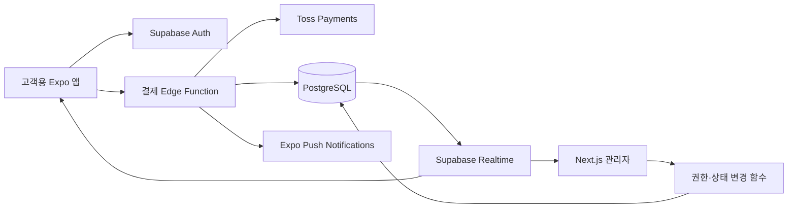
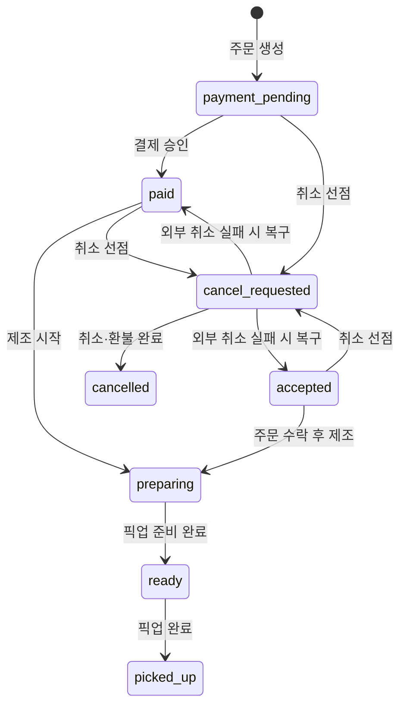

# 힘내개 ☕

> 카페 메뉴 탐색부터 주문·결제, 픽업 상태 알림과 관리자 운영까지 하나의 상태 흐름으로 연결한 모바일 주문 서비스입니다.

고객용 **Expo 앱**, 매장용 **Next.js 관리자 페이지**, **Supabase 백엔드**를 함께 설계하고 구현한 개인 프로젝트입니다. 결제 성공 화면만 구현하는 데 그치지 않고 중복 승인, 취소와 제조 시작의 경합, 외부 결제 취소 실패, 관리자 동시 수정처럼 실제 운영 중 발생할 수 있는 실패 상황을 서버와 데이터베이스 단계에서 처리했습니다.

- 개발 기간: 2026.08.10 ~ 진행 중
- 현재 상태: 배포 전 최종 점검
- 상세 포트폴리오: [Notion에서 보기](https://app.notion.com/p/3befba98a38f81a596a4d4022fae4915)

## 서비스 구성



| 영역 | 기술 |
| --- | --- |
| Mobile | Expo 54, React Native 0.81, React 19, TypeScript |
| Admin | Next.js 16, React 19, TypeScript, Tailwind CSS |
| Backend | Supabase Auth, PostgreSQL, RLS, Realtime, Edge Functions |
| External | Toss Payments, Expo Notifications, EAS Build |

## 주요 기능

### 고객용 모바일 앱

- 이메일 회원가입·로그인과 비밀번호 재설정
- 메뉴 탐색, 온도·샷·연하게·두유·개인 텀블러 옵션 선택
- 장바구니, 즉시/예약 픽업 시간 지정과 Toss Payments 결제
- 주문 내역 조회, 허용된 상태의 주문 취소와 환불
- Realtime 주문 상태 동기화와 주문 상태 푸시 알림
- 계정 설정, 알림 내역 확인과 회원 탈퇴

### 관리자 페이지

- 관리자 권한 검증 후 주문·메뉴·회원·매장 설정 접근
- 실시간 주문 조회와 허용된 순서의 상태 변경
- 메뉴 등록·수정, 판매 여부와 이미지 관리
- 회원 상태와 관리자 메모 관리
- 매장 영업 상태와 운영 정보 관리

## 주문 상태 흐름



## 핵심 문제 해결

### 1. 결제 금액 조작과 중복 승인 방지

클라이언트가 전달한 상품명과 금액을 그대로 신뢰하지 않습니다. 서버가 메뉴 ID로 판매 상태와 가격을 다시 조회하고 옵션 가격까지 재계산한 뒤 주문을 생성합니다. 결제 승인 시에도 JWT 사용자, 주문 소유자, 서버 주문 금액과 현재 상태를 다시 검증합니다.

동시에 승인 요청이 들어오면 조건부 업데이트로 결제 상태를 `confirming`으로 먼저 선점합니다. Toss 승인 요청에는 주문 ID를 멱등성 키로 사용하고, 이미 완료된 요청은 기존 성공 결과로 종료합니다.

- 구현 근거: [`supabase/functions/toss-payment/index.ts`](supabase/functions/toss-payment/index.ts)
- 보안 강화 마이그레이션: [`202608130001_harden_authorization.sql`](supabase/migrations/202608130001_harden_authorization.sql)

### 2. 외부 결제 취소 실패 시 주문 상태 복구

고객 취소와 매장의 제조 시작이 동시에 실행되지 않도록 주문 상태를 `cancel_requested`로 먼저 선점합니다. Toss 취소 요청에는 `cancel-{orderId}` 멱등성 키를 적용합니다.

네트워크 오류나 Toss API 실패가 발생하면 주문을 취소 완료로 남기지 않고 선점 전 상태로 복구합니다. 복구 여부도 응답에 포함해 외부 결제 결과와 내부 주문 상태가 어긋나는 상황을 확인할 수 있게 했습니다.

- 구현 근거: [`supabase/functions/cancel-payment/index.ts`](supabase/functions/cancel-payment/index.ts)

### 3. 관리자 동시 수정과 상태 역행 차단

관리자가 주문 테이블을 직접 수정하는 정책을 제거하고 상태 변경을 PostgreSQL 함수로 제한했습니다. 함수 내부에서 관리자 권한을 다시 확인하고, `FOR UPDATE` 행 잠금과 예상 상태 비교를 거친 뒤 정해진 순서의 전이만 허용합니다.

- 구현 근거: [`202608130001_harden_authorization.sql`](supabase/migrations/202608130001_harden_authorization.sql)

### 4. 권한 경계와 계정 보안

- RLS로 고객은 본인의 주문·알림·푸시 토큰만 조회하거나 처리
- 관리자 기능은 `is_admin()` 검증을 거친 전용 함수로 제한
- Toss 시크릿 키와 Supabase 서비스 역할 키는 Edge Function 환경에서만 사용
- 회원 탈퇴 시 프로필을 익명화하고 기존 푸시 토큰을 제거
- 한 기기의 푸시 토큰이 다른 계정으로 로그인되면 최신 계정으로 소유권 재지정

- 권한 강화: [`202608130001_harden_authorization.sql`](supabase/migrations/202608130001_harden_authorization.sql)
- 탈퇴 처리: [`202608130002_account_security.sql`](supabase/migrations/202608130002_account_security.sql)

### 5. 동시 주문에서도 겹치지 않는 일별 주문번호

애플리케이션에서 마지막 번호를 조회한 뒤 증가시키는 방식 대신 PostgreSQL의 `INSERT ... ON CONFLICT DO UPDATE`와 트리거를 사용합니다. 같은 날 주문이 동시에 생성되어도 데이터베이스가 `A-YYYYMMDD-N` 형식의 번호를 원자적으로 발급합니다.

- 구현 근거: [`202608110008_create_daily_order_numbers.sql`](supabase/migrations/202608110008_create_daily_order_numbers.sql)

## 프로젝트 구조

```text
himnaegae/
├─ mobile/                     # Expo / React Native 고객 앱
│  ├─ src/screens/             # 인증, 메뉴, 장바구니, 결제, 주문 화면
│  ├─ src/context/             # 인증 상태 관리
│  └─ src/lib/                 # Supabase, 알림, 주문번호 유틸리티
├─ admin/                      # Next.js 관리자 페이지
│  └─ src/app/                 # 주문, 메뉴, 회원, 매장 설정
└─ supabase/
   ├─ functions/               # 결제·취소·알림·회원 탈퇴 Edge Functions
   └─ migrations/              # 스키마, RLS, RPC, 트리거 마이그레이션
```

## 로컬 실행

### 준비 사항

- Node.js 20 이상과 npm
- Supabase 프로젝트
- Toss Payments 테스트 클라이언트 키와 시크릿 키
- 모바일 푸시 알림 확인 시 Expo/EAS 프로젝트

### 환경 변수

고객 앱은 `mobile/.env.example`을 `mobile/.env`로 복사하고 값을 설정합니다.

```dotenv
EXPO_PUBLIC_SUPABASE_URL=https://YOUR_PROJECT.supabase.co
EXPO_PUBLIC_SUPABASE_PUBLISHABLE_KEY=YOUR_PUBLISHABLE_KEY
EXPO_PUBLIC_TOSS_CLIENT_KEY=test_ck_YOUR_TEST_CLIENT_KEY
EXPO_PUBLIC_EAS_PROJECT_ID=YOUR_EAS_PROJECT_ID
```

관리자 페이지는 `admin/.env.example`을 `admin/.env.local`로 복사하고 값을 설정합니다.

```dotenv
NEXT_PUBLIC_SUPABASE_URL=https://YOUR_PROJECT.supabase.co
NEXT_PUBLIC_SUPABASE_PUBLISHABLE_KEY=YOUR_PUBLISHABLE_KEY
```

`TOSS_SECRET_KEY`와 Supabase 서비스 역할 키는 클라이언트 환경 변수나 Git에 저장하지 않고 Supabase Edge Function Secrets에서 관리합니다.

### 고객 앱

```powershell
cd mobile
npm install
npm start
```

개발 빌드로 확인할 때는 다음 명령을 사용합니다.

```powershell
npm run start:dev-client
```

### 관리자 페이지

```powershell
cd admin
npm install
npm run dev
```

- 기본 주소: `http://localhost:3000`

### Supabase

프로젝트 루트에서 Supabase CLI로 로그인하고 대상 프로젝트를 연결한 뒤 마이그레이션과 함수를 배포합니다.

```powershell
npx supabase login
npx supabase link --project-ref YOUR_PROJECT_REF
npx supabase db push
npx supabase functions deploy toss-payment --project-ref YOUR_PROJECT_REF --use-api
npx supabase functions deploy cancel-payment --project-ref YOUR_PROJECT_REF --use-api
npx supabase functions deploy send-order-notification --project-ref YOUR_PROJECT_REF --use-api
npx supabase functions deploy delete-account --project-ref YOUR_PROJECT_REF --use-api
```

## 현재 상태

핵심 주문·결제·취소·상태 동기화·알림·관리자 기능 구현을 마쳤으며 현재 배포 전 최종 점검 단계입니다. 배포 환경에서는 운영용 도메인과 환경 변수, Toss 운영 키, Supabase 마이그레이션·함수 버전, EAS 및 Next.js 프로덕션 빌드를 함께 확인합니다.
