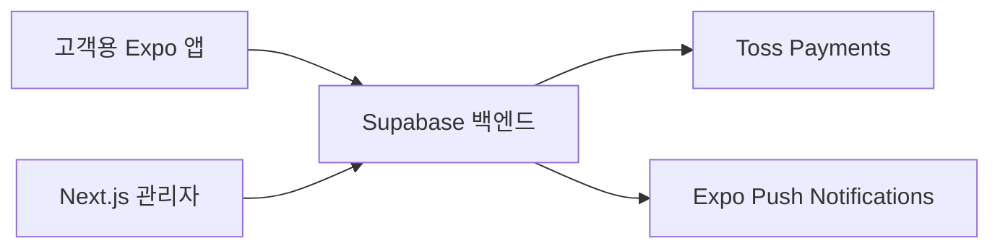

# 힘내개 ☕

> 카페 메뉴 탐색부터 주문·결제, 픽업 상태 알림과 관리자 운영까지 하나의 상태 흐름으로 연결한 모바일 주문 서비스입니다.

고객용 **Expo 앱**, 매장용 **Next.js 관리자 페이지**, **Supabase 백엔드**를 함께 설계하고 구현한 개인 프로젝트입니다. 주문부터 결제, 픽업 준비와 알림까지 고객과 매장의 흐름이 자연스럽게 이어지는 경험을 만드는 데 집중했습니다.

- 개발 기간: 2026.08.10 ~ 진행 중
- 현재 상태: 배포 전 최종 점검
- 상세 포트폴리오: [Notion에서 보기](https://app.notion.com/p/3befba98a38f81a596a4d4022fae4915)

## 서비스 구성



| 영역 | 기술 |
| --- | --- |
| Mobile | Expo 54, React Native 0.81, React 19, TypeScript |
| Admin | Next.js 16, React 19, TypeScript, Tailwind CSS |
| Backend | Supabase Auth, PostgreSQL, RLS, Realtime, Edge Functions |
| External | Toss Payments, Expo Notifications, EAS Build |

## 주요 기능

### 고객용 모바일 앱

- 이메일 회원가입·로그인과 비밀번호 재설정
- 메뉴 탐색, 온도·샷·연하게·두유·개인 텀블러 옵션 선택
- 장바구니, 즉시/예약 픽업 시간 지정과 Toss Payments 결제
- 주문 내역 조회, 허용된 상태의 주문 취소와 환불
- Realtime 주문 상태 동기화와 주문 상태 푸시 알림
- 계정 설정, 알림 내역 확인과 회원 탈퇴

### 관리자 페이지

- 관리자 권한 검증 후 주문·메뉴·회원·매장 설정 접근
- 실시간 주문 조회와 허용된 순서의 상태 변경
- 메뉴 등록·수정, 판매 여부와 이미지 관리
- 회원 상태와 관리자 메모 관리
- 매장 영업 상태와 운영 정보 관리

## 서비스 흐름


## 개발 과정에서 중점적으로 고민한 부분

### 안정적인 결제와 취소 흐름

결제 요청이 반복되거나 외부 결제 서비스의 응답이 지연되는 상황에서도 주문과 결제 결과가 서로 다르게 남지 않도록 전체 흐름을 설계했습니다. 취소 과정에서도 성공과 실패 결과가 고객 앱과 관리자 페이지에 일관되게 반영되도록 구성했습니다.

### 고객 앱과 관리자 페이지의 상태 일치

고객이 확인하는 주문 현황과 매장에서 처리하는 주문 상태가 같은 기준으로 변경되도록 만들었습니다. 실시간 동기화와 알림을 연결해 주문 접수부터 픽업 완료까지의 진행 상황을 확인할 수 있습니다.

### 사용자별 역할과 접근 범위 구분

고객과 관리자가 각자 필요한 정보와 기능에만 접근하도록 역할을 분리했습니다. 민감한 설정값은 고객 앱이나 저장소에 포함하지 않고 서버 환경에서 관리합니다.

## 프로젝트 구조

```text
himnaegae/
├─ mobile/       # Expo / React Native 고객 앱
├─ admin/        # Next.js 관리자 페이지
└─ supabase/     # 데이터베이스와 서버 기능
```

## 로컬 실행

### 준비 사항

- Node.js 20 이상과 npm
- Supabase 프로젝트
- Toss Payments 테스트 환경
- 모바일 푸시 알림 확인 시 Expo/EAS 프로젝트

### 환경 변수

고객 앱은 `mobile/.env.example`, 관리자 페이지는 `admin/.env.example`을 참고해 각 로컬 환경 파일을 설정합니다. 실제 환경 변수 값은 저장소에 포함하지 않습니다.

### 고객 앱

```powershell
cd mobile
npm install
npm start
```

개발 빌드로 확인할 때는 다음 명령을 사용합니다.

```powershell
npm run start:dev-client
```

### 관리자 페이지

```powershell
cd admin
npm install
npm run dev
```

- 기본 주소: `http://localhost:3000`

## 현재 상태

핵심 주문·결제·취소·상태 동기화·알림·관리자 기능 구현을 마쳤으며 현재 배포 전 최종 점검 단계입니다.
